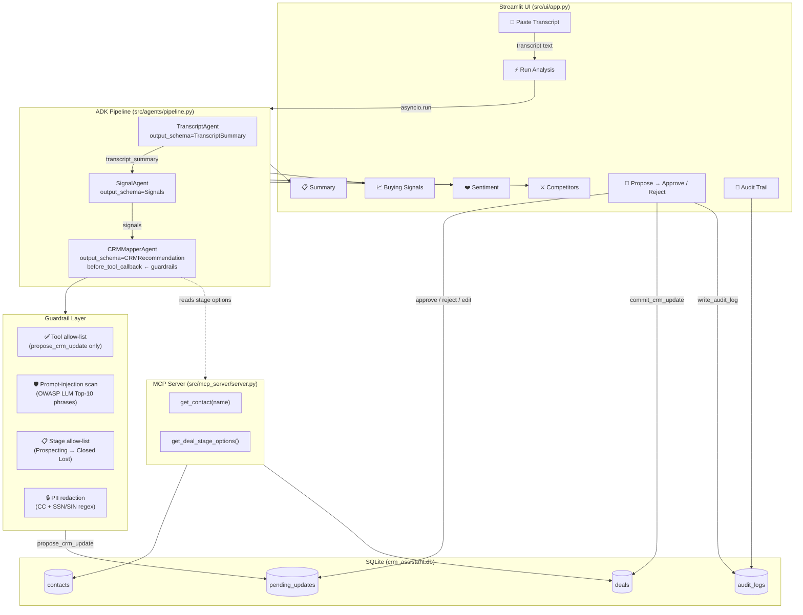

# 💼 CRM Meeting Assistant

> **AI-powered sales copilot** — paste a meeting transcript, get a structured analysis, and sync approved updates to your CRM in one click.

This project combines a multi-agent ADK pipeline, read-only MCP tools, a human-in-the-loop Streamlit workflow, and a custom transcript-handoff skill that converts messy call notes into a clean handoff for sales operations. The agent proposes CRM updates, but every write still requires human approval.

Built with **Google ADK** (multi-agent pipeline), **MCP** (Model Context Protocol server), **Streamlit** (human-in-the-loop UI), **SQLite** (local CRM store), and a custom **transcript-handoff skill** that turns raw call notes into a clean downstream summary. Designed for hackathon demo and rapid prototyping.

---

## Architecture



### Key Design Decisions

| Area                  | Decision                                                          | Rationale                                                                                       |
| --------------------- | ----------------------------------------------------------------- | ----------------------------------------------------------------------------------------------- |
| **Multi-agent**       | `SequentialAgent`: TranscriptAgent → SignalAgent → CRMMapperAgent | Each stage enriches session state; downstream agents see previous outputs                       |
| **Structured output** | `output_schema=Pydantic` on each agent                            | Eliminates JSON parsing fragility; enforces typed contracts between agents                      |
| **Guardrails**        | `before_tool_callback` on `CRMMapperAgent`                        | Blocks rogue tool calls, injection phrases, invalid stages, and PII before any write            |
| **Human-in-the-loop** | `pending_updates` table + Tab 7 review UI                         | **No AI output ever reaches the CRM directly** — every write requires human Approve/Edit/Reject |
| **MCP server**        | `FastMCP` exposing read-only contact and stage queries            | Agents get structured data access without direct DB coupling                                    |
| **Custom skill**      | `transcript-handoff-skill` injected into `TranscriptAgent`        | Standardises how transcript summaries, action items, and follow-up tasks are extracted          |
| **SQLite WAL**        | `PRAGMA journal_mode = WAL` + `busy_timeout = 5000`               | Prevents "database is locked" errors under Streamlit's concurrent rendering                     |
| **Column security**   | `ALLOWED_DB_COLUMNS` allow-list per table                         | Prevents AI-generated field names from injecting arbitrary columns into the SQL `SET` clause    |

---

## Prerequisites

| Tool                 | Install                                                           |
| -------------------- | ----------------------------------------------------------------- |
| **uv**               | `curl -LsSf https://astral.sh/uv/install.sh \| sh`                |
| **agents-cli**       | `uv tool install google-agents-cli`                               |
| **Google Cloud SDK** | [cloud.google.com/sdk](https://cloud.google.com/sdk/docs/install) |
| Python ≥ 3.11        | Managed by `uv` automatically                                     |

---

## Quick Start (Hackathon Demo)

### 1. Clone & install

```bash
git clone <repo-url>
cd crm-meeting-assistant
agents-cli install
```

### 2. Configure credentials

```bash
cp .env.example .env
```

**Option A — Vertex AI (recommended for GCP projects):**

```bash
# In .env:
GOOGLE_GENAI_USE_VERTEXAI=true
GOOGLE_CLOUD_PROJECT=your-gcp-project-id
GOOGLE_CLOUD_LOCATION=global

# Authenticate:
gcloud auth application-default login
```

**Option B — Google AI Studio (fastest for hackathon, no GCP needed):**

```bash
# In .env, comment out Vertex lines and set:
GEMINI_API_KEY=your-api-key-from-aistudio.google.com
```

### 3. Seed demo data

```bash
uv run python -m src.database.populate_demo
# ✅  SQLite database populated with demo data.
```

### 4. Launch the UI

```bash
uv run streamlit run src/ui/app.py
# → Opens at http://localhost:8501
```

### 5. Demo flow (5-minute walkthrough)

| Step | Tab                      | What to do                                                       |
| ---- | ------------------------ | ---------------------------------------------------------------- |
| 1    | **1 – Paste Transcript** | Select `normal_sales_call.txt` from the dropdown                 |
| 2    | **2 – Run Analysis**     | Click **▶ Start AI Analysis** (30–60 s)                          |
| 3    | **3 – Summary**          | Read the executive summary and action items                      |
| 4    | **4 – Buying Signals**   | See positive/negative deal signals                               |
| 5    | **5 – Sentiment**        | Check overall prospect sentiment                                 |
| 6    | **6 – Competitors**      | See any mentioned competitors                                    |
| 7    | **7 – Proposed Updates** | Enter your name, optionally edit the stage, click **✅ Approve** |
| 8    | **8 – Activity History** | Confirm the audit trail recorded the decision                    |

> **Tip:** Try `prompt_injection_attempt.txt` to demo the guardrails blocking the attack live.

## Deploy on Hugging Face Spaces

This project is ready to run as a **Docker Space** on Hugging Face. The container launches the Streamlit UI, which is the safest path for the public demo because it avoids the FastAPI telemetry startup that requires Google ADC.

### 1. Create the Space

- On Hugging Face, create a new Space.
- Choose **Docker** as the SDK.
- Connect it to this repository.

### 2. Add secrets

Add the API secret you want to use for the model backend:

- `GEMINI_API_KEY` for Google AI Studio, or
- `GOOGLE_GENAI_USE_VERTEXAI=true` plus `GOOGLE_CLOUD_PROJECT` and `GOOGLE_CLOUD_LOCATION` for Vertex AI.

### 3. Build and run

The provided `Dockerfile` installs dependencies, copies the app source, and starts Streamlit on port `7860`, which is the default Hugging Face Space port.

### 4. Data setup

If you want the demo data available on first launch, make sure the database seed step is part of your workflow before building, or add a small startup step that runs `uv run python -m src.database.populate_demo` once.

### 5. Public demo notes

- Use the Streamlit UI at the Space URL.
- Upload or paste a transcript.
- Run analysis from Tab 1.
- Review proposed CRM updates before approving them.

If you want to host the FastAPI/A2A backend as well, keep it in a separate service. For the public Kaggle demo, the Streamlit Space is the simplest deployment target.

---

## All Commands

| Command                                         | Purpose                            |
| ----------------------------------------------- | ---------------------------------- |
| `uv run streamlit run src/ui/app.py`            | Launch the Streamlit demo UI       |
| `uv run python -m src.database.populate_demo`   | Re-seed demo SQLite data           |
| `agents-cli playground`                         | Interactive ADK playground         |
| `uv run pytest tests/unit tests/integration -v` | Run all tests                      |
| `agents-cli lint`                               | Run ruff + codespell               |
| `agents-cli eval generate`                      | Run agent on eval dataset          |
| `agents-cli eval grade`                         | Grade agent traces                 |
| `agents-cli eval compare`                       | Regression diff between two runs   |
| `agents-cli eval optimize`                      | Auto-tune prompts via eval data    |
| `agents-cli deploy`                             | Deploy to Cloud Run (requires GCP) |

---

## Project Structure

```
crm-meeting-assistant/
├── app/                          # ADK app (FastAPI + A2A deployment entry point)
│   ├── agent.py                  # Root ParallelAgent pipeline
│   ├── crm_mcp_server.py         # Standalone stdio MCP server (in-memory demo)
│   └── fast_api_app.py           # FastAPI + A2A server
│
├── src/
│   ├── agents/
│   │   ├── pipeline.py           # SequentialAgent pipeline (Streamlit UI path)
│   │   └── schemas.py            # Pydantic output schemas (typed agent contracts)
│   ├── database/
│   │   ├── db_helper.py          # SQLite helper (WAL, FK, error-safe queries)
│   │   ├── schema.sql            # Table DDL + covering indexes
│   │   └── populate_demo.py      # Demo data seeder
│   ├── mcp_server/
│   │   └── server.py             # FastMCP read-only CRM tools
│   ├── services/
│   │   └── crm_service.py        # pending_updates lifecycle + audit log
│   ├── skills/
│   │   ├── transcript-handoff-skill/
│   │   │   ├── SKILL.md          # Transcript handoff guidance for TranscriptAgent
│   │   │   └── playbook.md       # Transcript extraction playbook
│   │   └── deal-scoring-skill/
│   │       └── playbook.md       # Deal-scoring rules injected into CRMMapperAgent
│   ├── ui/
│   │   └── app.py                # 8-tab Streamlit UI
│   └── utils/
│       ├── config.py             # All constants (env-var overrideable)
│       └── logging_config.py     # Centralised logger factory
│
├── sample_data/transcripts/      # 4 demo scenarios (normal, competitor, stalled, injection)
├── tests/
│   ├── unit/
│   │   ├── test_dummy.py         # Placeholder (kept for scaffold compat)
│   │   └── test_guardrails.py    # Guardrail, PII, column allow-list tests
│   └── integration/              # (extend here)
├── .env.example                  # Credential template
├── pyproject.toml                # uv / ruff / pytest config
└── Dockerfile                    # Cloud Run container
```

---

## Security Model

```
Transcript (untrusted)
    ↓
TranscriptAgent / SignalAgent   ← read-only; no tool calls
    ↓
CRMMapperAgent  ←  before_tool_callback runs:
    ├─ Tool allow-list          (only propose_crm_update)
    ├─ Prompt-injection scan    (OWASP LLM Top-10 phrases)
    ├─ CRM stage allow-list     (Prospecting → Closed Lost)
    └─ PII redaction            (CC numbers, SSN/SIN)
    ↓
pending_updates table           ← staged, NOT yet committed
    ↓
Human review (Tab 7)            ← Approve / Edit / Reject
    ↓
_apply_changes_to_table  ←  column allow-list per table
    ↓
deals / contacts                ← committed
    ↓
audit_logs                      ← immutable record of every decision
```

---

## Running Tests

```bash
uv run pytest tests/unit tests/integration -v
```

Covers:

- Prompt-injection blocking via `before_tool_callback`
- PII redaction (credit card + SSN/SIN patterns)
- CRM stage allow-list enforcement
- SQL column allow-list (blocks AI column injection)
- SQLite WAL mode and foreign-key pragma verification

---

## Future Improvements

### Near-term

- [ ] **Deal selection UI** — let users choose which deal to attach the analysis to (replace placeholder `target_id=1`)
- [ ] **Parallel pipeline in Streamlit** — mirror the `ParallelAgent` pattern from `app/agent.py` for 5× faster analysis
- [ ] **Streaming progress** — use ADK's event stream to show per-agent status in real time instead of a single spinner
- [ ] **Eval dataset** — run `agents-cli eval dataset synthesize`; build 10+ graded scenarios; use `agents-cli eval optimize` to tune prompts

### Medium-term

- [ ] **Live MCP integration** — wire `src/mcp_server/server.py` into the pipeline via `MCPToolset` so agents query live contacts/deals
- [ ] **Meetings table** — link transcripts ↔ meetings ↔ deals via proper FK relationships
- [ ] **OAuth approver identity** — replace free-text approver name with Google Identity (IAP or Firebase Auth)
- [ ] **Webhook on approval** — fire a Pub/Sub event or Salesforce API call on approve, enabling real CRM sync

### Long-term

- [ ] **Persistent sessions** — swap `InMemorySessionService` for `DatabaseSessionService` (Firestore / Cloud SQL) for multi-user support
- [ ] **A2A interoperability** — expose the pipeline as an A2A agent for programmatic invocation by other agents
- [ ] **BigQuery analytics** — stream audit logs to BigQuery for win-rate and deal-velocity dashboards
- [ ] **Voice input** — integrate Speech-to-Text so reps can record calls directly instead of pasting transcripts

---

## License

Apache 2.0 — see `LICENSE` for details.
